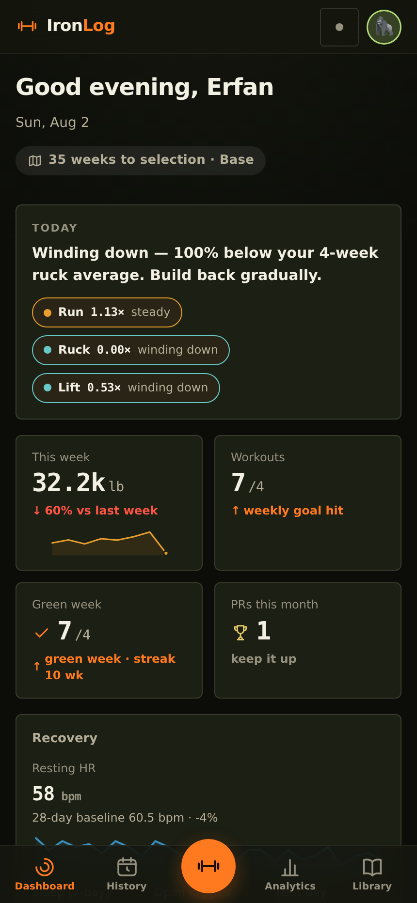
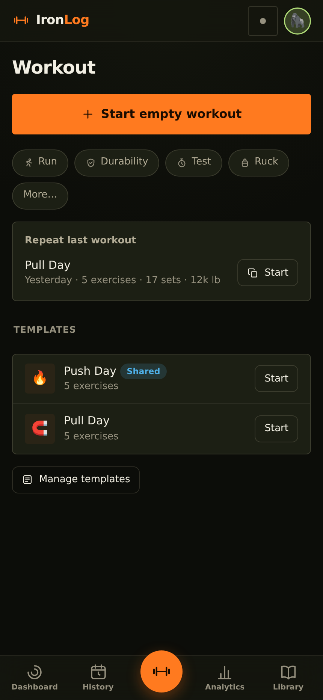
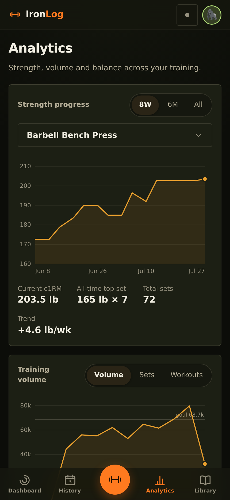
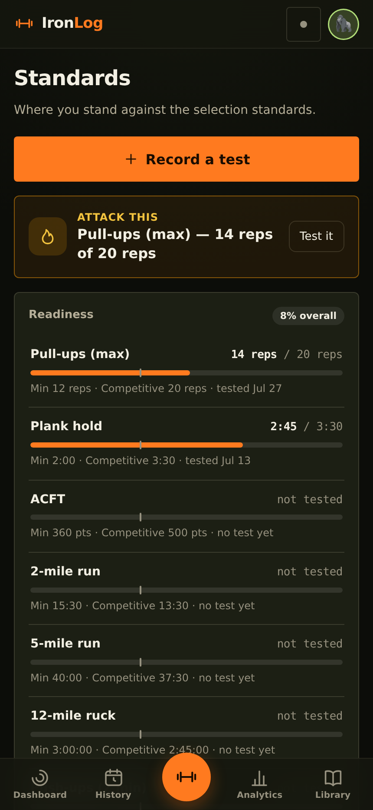
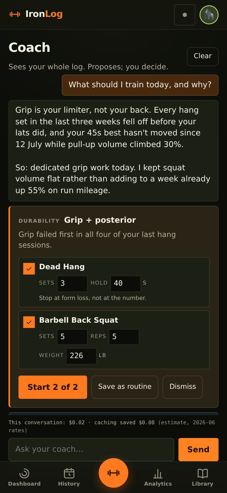
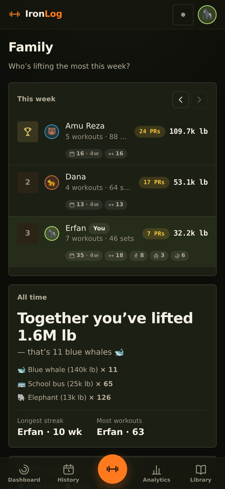
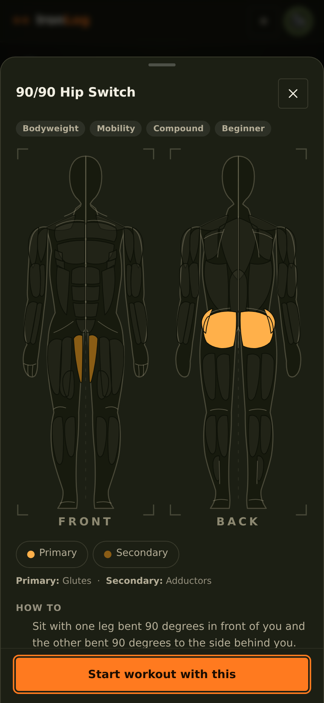
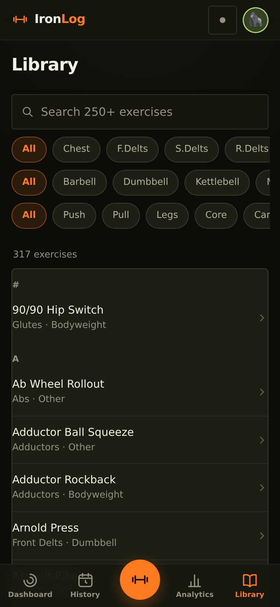
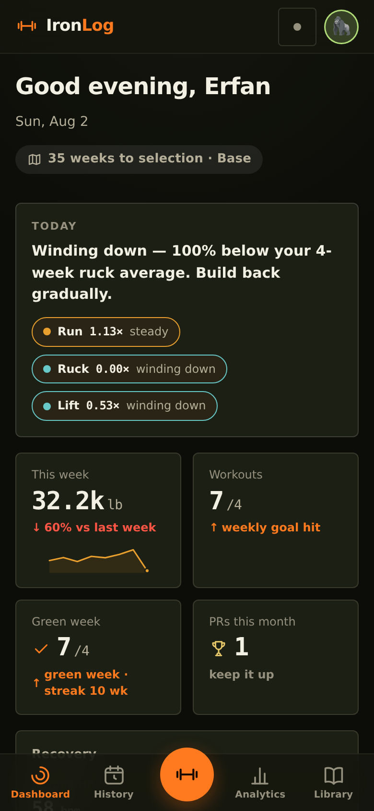

# IronLog 🏋️ — training log for a family, built around one hard goal

A multi-user training app that starts as a straightforward gym log and, when you
ask it to, turns into a selection-prep system: cardio, rucking, durability,
flexibility, injury guardrails, military standards, and a coach that has read
every session you have ever logged.

Pure static HTML/CSS/JS. No accounts, no server, no build step, no dependencies.
Works offline once loaded, installs to your home screen.

## Two modes, on purpose

**Simple mode** is the whole app for someone who just lifts: log sets, see your
history, watch your numbers go up. Nothing else appears.

**Performance mode** (Settings → Training) unlocks everything below. It exists so
one person can chase a Green Beret while another logs bench press on the same
codebase, and neither has to see the other's app.

This split is enforced everywhere, not decorated. A simple-mode profile never
renders a performance surface — there are tests whose whole job is to prove it.

## Screenshots

| Dashboard | Workout logging | Analytics |
|---|---|---|
|  |  |  |

| Standards | AI coach | Family leaderboard |
|---|---|---|
|  |  |  |

| Exercise detail | Library on mobile | Dashboard on mobile |
|---|---|---|
|  |  |  |

## What it does

### Logging — every kind of training, not just lifting

- **Lifting** — fast set/rep/weight entry with previous-performance hints, warmup
  sets, RPE, rest timer, plate calculator, routines, notes, fully editable history.
- **Cardio** — run, ruck, swim, bike, row, stairs, walk, circuit. Rucks record dry
  and total load, surface, footwear and elevation, because those are what break
  feet.
- **Structured set work** — holds, carries, stretches and unilateral work are
  logged as real sets with reps, hold seconds, distance, load, side, and a 1–4
  stretch-depth scale. Not "20 minutes of mobility".
- **Tests** — ACFT events, timed runs, the 12-mile ruck, max pull-ups, dead hang,
  plank, 500 m swim.
- **317 exercises** with muscles, equipment, instructions and coaching tips, plus
  your own custom ones.

### The live session

Start a session and do it — the app follows along instead of being filled in
afterwards. Pace is a **layer**, not a mode: the timer can drive a set, an
exercise, or the whole session, or nothing at all, and you can change it mid-
workout. Durability and stretching default to per-set pacing because they want
room to tinker; circuits drive the whole session because they are time-sensitive.

You can edit anything while it runs. A prescription you never performed is never
recorded as work you did.

### Knowing whether you are training or digging a hole

- **Injury guardrails** — ruck load-and-distance double increases, run ramp rate,
  easy/hard split, rest days, deep-stretch limits, and a pain log that escalates
  bone-line pain, morning pain and pain that climbs during a session.
- **Load model** — acute:chronic workload per modality, with an honest "not
  enough history yet" instead of a fabricated ratio in your first week.
- **Recovery** — per-muscle freshness, resting-HR baseline and spikes, ruck
  economy trend.
- **Standards** — where you stand against SFAS and ACFT two-tier targets, scored
  by the real tables, with a training phase derived from your selection date.

### The AI coach (optional)

Bring your own Anthropic API key (Settings → AI Coach) and a Coach tab appears.
It reads **everything** — every session, the pain log, the journal, and the
figures the app itself computed — and it:

- answers questions about your training, citing actual dates and sessions
- **proposes sessions you can edit**: tick items on or off, change any number,
  then start it as a normal guided session
- **asks you questions** ("how did that last set of hangs feel in the elbows?").
  Your answer is saved to your journal, and it is in the context next time. That
  loop is the point.

Two things it cannot do: it cannot log anything (it proposes, you commit), and it
cannot talk its way past your injury guardrails. Those are checked by the app
after the reply arrives, twice — once before you see a proposal and again when
you accept it. There is no override button anywhere.

**Your key never leaves your device.** It is stored outside the synced state on
purpose: backups and family sync both carry that state, and this repository is
public. Each device keeps its own key. Requests are billed to you; the Coach
screen shows a running cost estimate and what prompt caching saved.

### Family

Unlimited profiles, one-tap switching, a friendly weekly leaderboard, and
per-profile colour themes (Field / Issued, Classic Green, Slate, Ember) so each
person's app looks like theirs. Themes change colour only — never layout — and
every palette is validated for colourblind-safe chart series and contrast.

### Apple Health

Import your `export.zip` in the browser: body weight and body fat, steps, resting
heart rate, active energy, exercise minutes, VO₂max, sleep, and workouts. Parsed
locally, previewed before anything is added, nothing uploaded. Walks import as
walks — not as runs, which would quietly inflate your mileage and your injury
guardrails with it.

Export lifting history as CSV or everything as a JSON backup.

*Live HealthKit sync is impossible for any pure web app — Apple exposes it to
native iOS apps only. The export/import loop is the standard approach.*

## Updates

The app tells you when a new version is ready and waits for you to take it. It
checks whenever you bring the app to the foreground. If you tap **Later** it will
ask again next time rather than stranding you on an old build.

## Run it

Static site — any web server works:

```bash
cd gym
python3 -m http.server 8000
# open http://localhost:8000
```

Live at `https://<your-pages-domain>/gym/`. On each phone: open the URL → Share →
**Add to Home Screen**. It launches full-screen and works offline.

## Where your data lives

On the device, in the browser (localStorage). Nothing is uploaded unless you
enable sync. Two ways to share between devices:

1. **Backup files** — Settings → Data → Export backup, send it, Import on the
   other device (choose *Merge*).
2. **Family sync** — below.

> Export a backup before clearing site data for this domain. That is where your
> log lives.

## Family sync setup (free, ~5 minutes, one person does it once)

1. <https://console.firebase.google.com> → **Add project** (any name, no Analytics).
2. **Build → Realtime Database → Create database** → pick a location → start in
   **test mode**.
3. Copy the database URL, e.g. `https://yourname-default-rtdb.firebaseio.com`.
4. Append a long random path segment to keep it private, e.g.
   `https://yourname-default-rtdb.firebaseio.com/ironlog-k92hf83hf`.
5. IronLog: **Settings → Family Sync** → paste → Enable → Sync now.
6. Send the same URL to your family; they paste it on their devices.

*Test-mode rules mean anyone with the exact URL can read and write it — the long
random segment is the secret. Reasonable for a small family log; rotate the
segment if it ever leaks.*

**Mixed versions are safe.** A phone running an older build merges with a newer
one without destroying data it does not understand: unknown collections, unknown
fields and unknown settings all round-trip untouched. This is a load-bearing
property with tests against the real older code, not a hope.

## Tech notes

- Plain script modules on `window` (`Store`, `Analytics`, `LoadModel`,
  `Guardrails`, `Protocols`, `Charts`, `MuscleMap`, `ExerciseDB`, `AppleHealth`,
  `Player`, `Coach`, `App`) — see `ARCHITECTURE.md`, which is the binding
  contract and explains *why*, not just what.
- All weights stored in kg internally, converted at the UI per profile.
- Hand-rolled responsive SVG charts. No colour is ever frozen in JavaScript — it
  is read from CSS custom properties at render time, which is what lets themes
  work at all.
- Apple Health zip unpacked in-browser (tiny ZIP reader + `DecompressionStream`),
  XML stream-parsed so 100 MB+ exports do not crash the tab.
- Coach calls `api.anthropic.com` directly from the device with prompt caching on
  the large stable context block, and streams the reply.
- Service worker caches the app shell for offline use.
